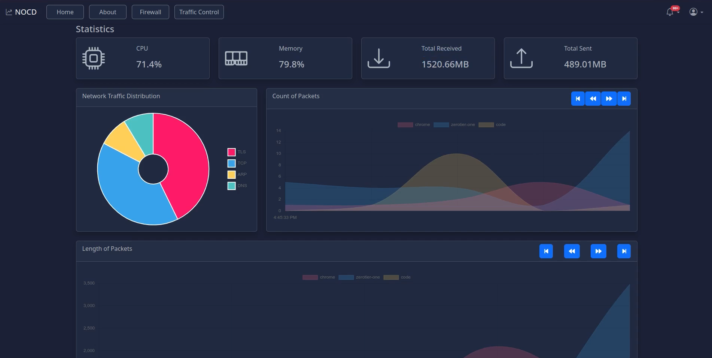
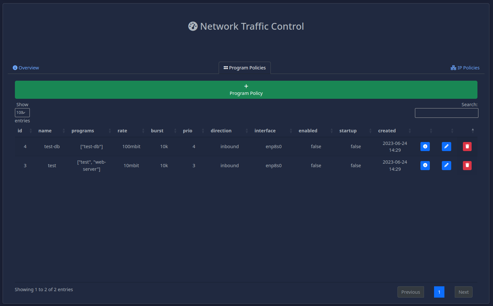
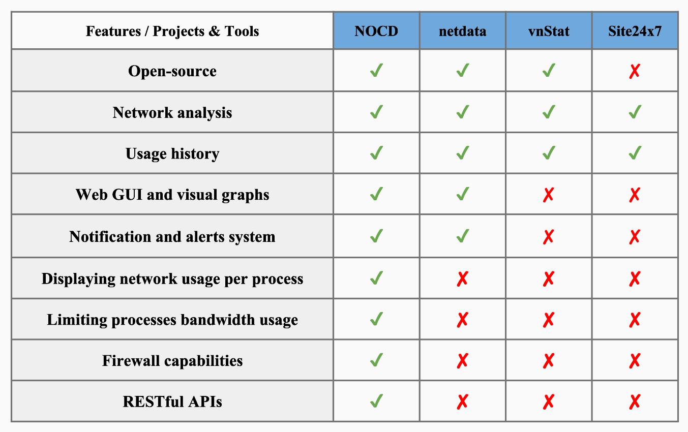

<div align="center">

  
  <h1>Network Operations Center for Debutant</h1>
  
  <p>
    Help people with little to no experience in networking to create and manage Linux networks
  </p>
  
  
<!-- Badges -->
<p>
  <a href="https://github.com/IPv18/NOCD/graphs/contributors">
    
  </a>
  <a href="">
    
  </a>
  <a href="https://github.com/IPv18/NOCD/network/members">
    
  </a>
  <a href="https://github.com/IPv18/NOCD/stargazers">
    
  </a>
  <a href="https://github.com/IPv18/NOCD/issues/">
    
  </a>
  <a href="https://github.com/IPv18/NOCD/blob/master/LICENSE">
    
  </a>
</p>
   
<h4>
    <a href="https://github.com/IPv18/NOCD/">View Demo</a>
  <span> · </span>
    <a href="https://github.com/IPv18/NOCD">Documentation</a>
  <span> · </span>
    <a href="https://github.com/IPv18/NOCD/issues/">Report Bug</a>
  <span> · </span>
    <a href="https://github.com/IPv18/NOCD/issues/">Request Feature</a>
  </h4>
</div>

<br />

<!-- Table of Contents -->
## :notebook_with_decorative_cover: Table of Contents

- [About the Project](#star2-about-the-project)
  - [Screenshots](#camera-screenshots)
  - [Tech Stack](#space_invader-tech-stack)
  - [Features comparison](#dart-features-comparison)
  - [Environment Variables](#key-environment-variables)\
- [Prerequisites](#bangbang-prerequisites)
- [Getting Started](#toolbox-getting-started)
  - [Virtual Environment](#globe_with_meridians-virtual-environment)
  - [Insalling Requirements](#package-insalling-requirements)
  - [Running tests](#test_tube-running-tests)
- [Run Locally](#computer-run-locally)
- [Roadmap](#compass-roadmap)  
- [Contributing](#wave-contributing)
- [License](#page_with_curl-license)
  

<!-- About the Project -->
## :star2: About the Project
NOCD is a micro NOC (Network Operations Center) that aims to help people with little to no experience in networking to create and manage their own network policies. The app provides easy to use tools to create and manage network policies, as well as a dashboard to monitor the network traffic and statistics.


<!-- Screenshots -->
### :camera: Screenshots

<div> 
  <ul>
    <li > Dashboard
      
    </li>
    <li> Traffic Control
      
    </li>
    <li> Apply Program-based Traffic Control Policy on  running processes
 </li>
      
https://github.com/IPv18/NOCD/assets/54727130/f2499854-8d03-419f-b81a-d6d85e2cd1ad
   
  </ul>
</div>


<!-- TechStack -->
### :space_invader: Tech Stack

<details>
  <summary>Front-End</summary>
  <ul>
    <li> JavaScript </li>
    <li> jquery </li>
    <li> Chart.js </li>
    <li> popper.js </li>
    <li> datatables </li>
    <li> Bootstrap </li>
    <li> django templates </li>
  </ul>
</details>

<details>
  <summary>Back-End</summary>
  <ul>
    <li> Django </li>
    <li> Django REST framework </li>
    <li> sqlite3 </li>
    <li>
      Linux / Network
      <ul> 
        <li> systemd </li>
        <li> Linux TC (traffic controll) </li>
        <li> iproute2</li>
        <li> tcpdump</li>
        <li> iptables </li>
      </ul>
    </li>
  </ul>
</details>


<details>
<summary>DevOps</summary>
  <ul>
    <li><a href="https://docs.github.com/en/actions">GitHub Actions</a></li>
    <li><a href="https://www.jenkins.io/">Jenkins</a></li>
    <li><a href="https://www.docker.com/">Docker</a></li>
  </ul>
</details>

<!-- Features -->
### :dart: Features comparison



<!-- Env Variables -->
### :key: Environment Variables

To run this project, you will need to add the following environment variables to your .env file

- `DEBUG` : `True` or `False` - if `True` the app will run in debug mode
- `DJANGO_SECRET` : Django secret key 
- `UPDATE_INTERVAL` : Interval in seconds to update the traffic statistics buffer
- Database variables:
  - `DB_ENGINE` : default `django.db.backends.sqlite3`
  - `DB_NAME`
  - `DB_USER`
  - `DB_PASS`
  - `DB_HOST`
  - `DB_PORT`


## :bangbang: Prerequisites

- Python 3.10 or higher
- pip
- Linux (tested on Raspbian)
- Systemd (optional for Program-based TC policies)
- iproute2
- tcpdump


<!-- Getting Started -->
## 	:toolbox: Getting Started

Clone the project

```bash
  git clone https://github.com/IPv18/NOCD.git
```

Go to the project directory

```bash
  cd NOCD
```


### :globe_with_meridians: Virtual Environment

To start, we need to create a python virtual environment for our project.

- We will be using pip so we need to make sure it is up to date. You can use this command to do that:

    #### Windows
    ```
    py -m pip install --upgrade pip
    ```

    #### Linux
    ```
    python3 -m pip install --user --upgrade pip
    ```

- Then we will need to install virtualenv, the package we will be using to create our virtual environment, run those commands:

    #### Windows
    ```
    py -m pip install --user virtualenv
    ```

    #### Linux
    ```
    python3 -m pip install --user virtualenv
    ```
- Now that we have the virtualenv package we can create our virtual environment like this:

    #### Windows
    ```
    py -m venv .venv
    ```

    #### Linux
    ```
    python3 -m venv .venv
    ```
- Finally, we will activate it like so:

    #### Windows
    ```
    .\.venv\Scripts\activate
    ```

    #### Linux
    ```
    source .venv/bin/activate
    ```

    If you are facing problems activating it on windows it might have to do with the terminal you are using, try doing this instead:
    ```
    source .venv/Scripts/activate
    ```

On your terminal it should now show something like this:
```
(.venv) <--
User@Machine MINGW64 ~/Documents/Homework
```
If it doesn't, try repeating the steps above.

<!-- Insalling requirements -->

### :package: Insalling Requirements

 Now that our virtual environment is working we will need to install some packages on it, there will be a file called ```requirements.txt``` included in the project, if you cannot find it try pulling from the remote repository, or alternitavely try cloning the repository again.

 To install the packages is quite simple, just run this command:

 ```
 pip install -r requirements.txt
 ```

 After that is done you should be ready to run the project.

   
<!-- Running Tests -->
### :test_tube: Running Tests

To run tests, run the following command

```bash
  python3 manage.py test
```


<!-- Run Locally -->
## :computer: Run Locally

Start the server

```bash
  python3 manage.py runserver
```


<!-- Roadmap -->
## :compass: Roadmap

* [x] Add traffic statistics
* [ ] Add multiprocess support
* [ ] Add AI assistant to help with network policies


<!-- Contributing -->
## :wave: Contributing

<a href="https://github.com/IPv18/NOCD/graphs/contributors">
  
</a>

<!-- License -->
## :page_with_curl: License

This project is licensed under the MIT License. See the [LICENSE](LICENSE) file for more information.
